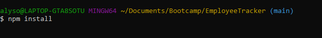
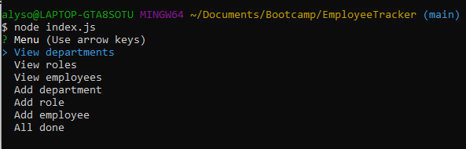
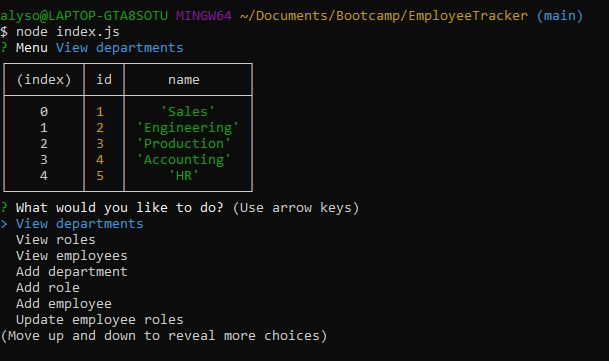

# Employee Tracking App

## Description

Developers are often tasked with creating interfaces that make it easy for non-developers to view and interact with information stored in databases. Often these interfaces are known as **C**ontent **M**anagement **S**ystems. This application offers companies a solution for managing their employees using node, inquirer, and MySQL.

```
As a business owner
I want to be able to view and manage the departments, roles, and employees in my company
So that I can organize and plan my business
```

## Table of Contents

* [Installation](#Installation)
* [Usage](#Usage)
* [License](#License)
* [Contributors](#Contributors)
* [Test](#Test)
* [Questions](#Questions)

## Installation

To successfully run this application, please do a npm install upon downloading the repo in your terminal.

```bash
npm install
```

This application comes with seed data to get the user started in the database. You will also have to access MySQL and create the database.  To do so, copy the schema from ```schema.sql``` into your local MySQL. You may also need to change the information in ```connection.js``` to mirror your information. 

## Usage

To use this application, first fork and open the repo onto your local machine. Before attempting to use the app, open your terminal and perform a ```npm install``` to get the necessary packages.



Now, while in the repo, type ```node index.js``` to start the app. 



Select a choice from the drop down menu to complete tasks.



Watch the gif below to see how the application works in your command line


## Credits

Alyson Bennett was the sole collaborator on this project. 

## License

[](https://lbesson.mit-license.org/)

[MIT](https://choosealicense.com/licenses/mit/)

Copyright (c) 2020 Alyson Bennett

## Contributing

Pull requests are welcome. For major changes, please open an issue first to discuss what you would like to change.

[](code_of_conduct.md)

## Tests

There has not been a test script written for this application yet.

## Issues

Due to time constraints, this application is still under development. The function to update an employees' role is not complete.

Future development will correct this issue, as well as adding additional features like updating an employees' manager, view employees my manager, and delete departments, roles, and employees. 

## Questions

If you have any questions, please contact [Alyson Bennett](https://github.com/alysonbennett) at alysonbennett@gmail.com.